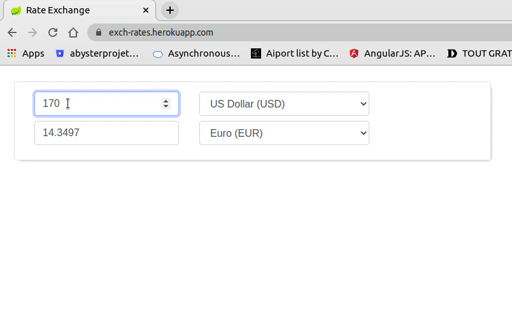

# exchangerate
Web application using spring boot to convert the amount based on the provided source/target currencies. I used [Redis](https://redis.io/) for cache management in order to get conversion results faster.

## project description
Using the https://exchangeratesapi.io API as our data source for currency rates, we created a basic web application using a Spring Boot and Spring Data framework including a basic HTML frontend that allows a user to do the following:
- post an exchange rate transaction request by calling an API endpoint
- calculate the converted amount based on the provided source/target currencies
- store this transaction in the database
- Caching of the exchange rates using redis for a predefined period of time
- return the transaction information back to the user in json format

## Heroku Deployment

The application is deployed on Hekou [https://exch-rates.herokuapp.com/](https://exch-rates.herokuapp.com/). 

Simple DEMO

